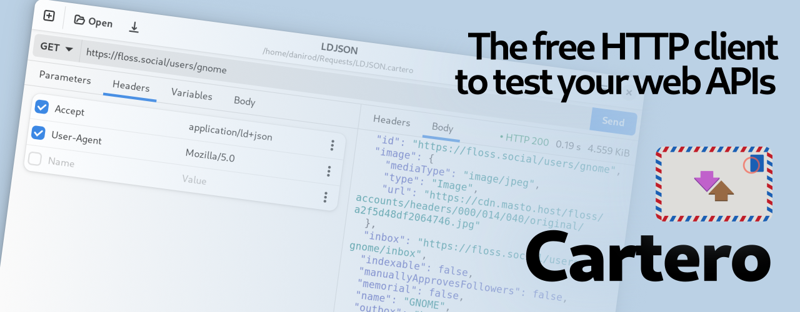

Cartero is a graphical HTTP client that can be used as a developer tool to
test web APIs and perform all kind of HTTP requests to web servers. It is
compatible with any REST, SOAP or XML-RPC API and it supports multiple request
methods as well as attaching body payloads to compatible requests.

**Features:**

- Loads and saves to plain Git-friendly TOML files, so that you can own your data.
- Customization and modification of the request headers and body payloads.
- Variable binding for API keys and other secret information.

**Motivation:**

This project exists because there aren't many native graphical HTTP testing
applications / graphical alternatives to cURL that are fully free software, and
I think the world has had enough of Electron / non-native applications that are
anonymously accesible until one day you are forced to create an account and
log in to use just to make some investor happy with their numbers or to chug
some unwanted artificial intelligence at users.

For more information, check [the homepage][cartero] or [the GitHub repository][gh].

[cartero]: https://cartero.danirod.es
[gh]: https://github.com/danirod/cartero
